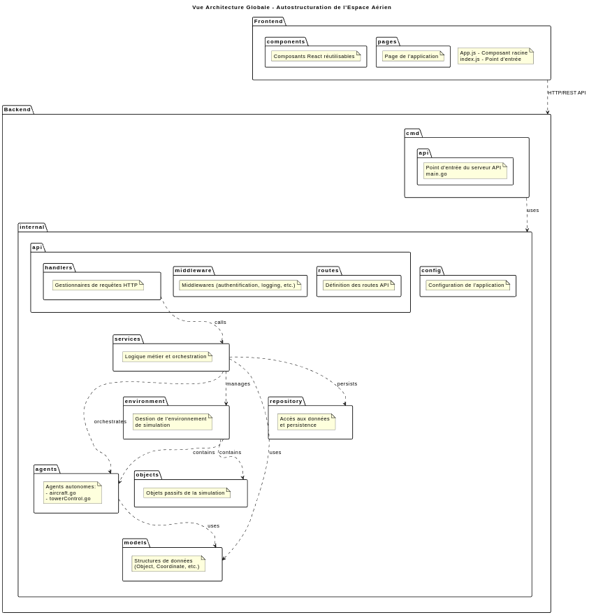
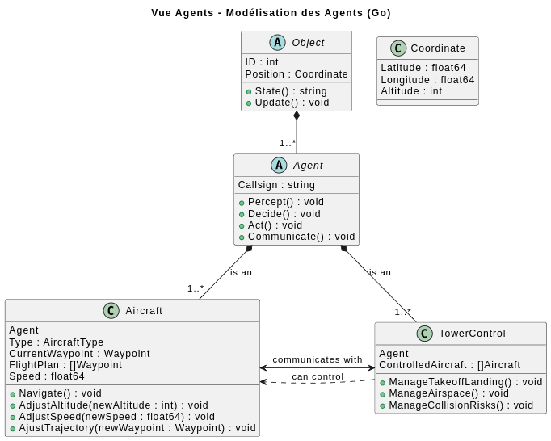
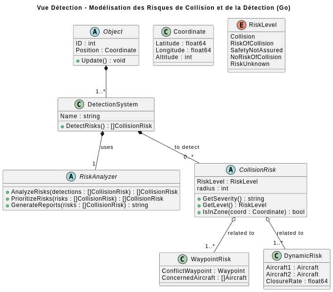
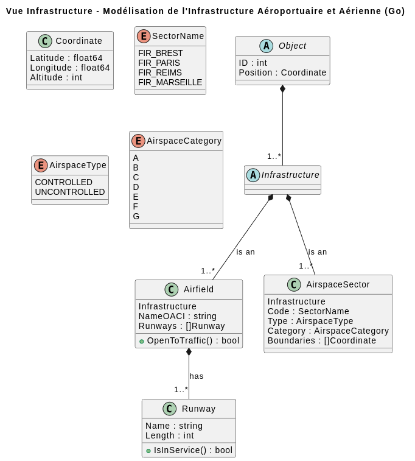
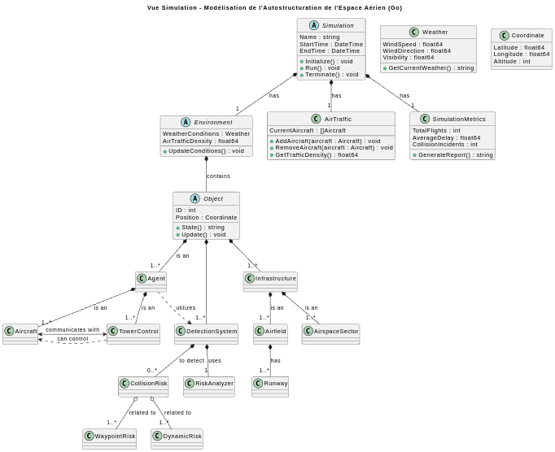

# Air Traffic Simulator

A multi-agent simulation of civil air traffic over **real French airspace**, populated with
**live aircraft**. Sector geometry, airways, waypoints and runways are loaded from the French
SIA's AIXM 4.5 aeronautical database; the traffic itself is seeded from a live ADS-B snapshot,
so the aircraft on screen are the ones actually flying when you start it.

Each aircraft is an autonomous agent running its own `Percept → Decide → Act → Communicate`
loop in its own goroutine. A control tower agent watches for loss of separation and negotiates
resolutions over a message bus — no aircraft is centrally puppeteered.

> Started as project AI30 at Université de Technologie de Compiègne, autumn 2025.



---

## Overview

| Package | Role |
|---|---|
| `backend/internal/agent` | Agent layer — `Agent` interface, `Aircraft`, `TowerControl`, typed message envelopes |
| `backend/internal/engine` | Simulation loop, flight physics, conflict detection, message router, command worker |
| `backend/internal/model` | Domain types — coordinates, sectors, collision risks |
| `backend/internal/infrastructure/persistence` | AIXM 4.5 XML decoding and its JSON projection |
| `backend/internal/service` | Data lifecycle — AIXM conversion, ADS-B fetch, route download, freshness checks |
| `backend/internal/handler` | HTTP handlers over the live simulation state |
| `backend/cmd/api` | Server: simulation + REST API + embedded frontend (port 7500) |
| `backend/cmd/xml2json` | Standalone AIXM → JSON converter |
| `backend/cmd/get-airplanes-data` | ADS-B snapshot fetcher (`api.adsb.lol`) |
| `backend/cmd/download-routes` | Flight-route enrichment for a snapshot |
| `frontend/simulation-front-end` | React 19 + react-leaflet map client |

### The agent loop

Every aircraft implements four phases, driven once per simulation step:

- **Percept** — read ADS-B reports broadcast by neighbouring aircraft
- **Decide** — evaluate the flight plan and any outstanding tower directive
- **Act** — apply heading, speed and altitude changes
- **Communicate** — broadcast its own position, acknowledge or reject directives



Messages are typed envelopes (`CONFLICT_ALERT`, `TOWER_DIRECTIVE`, `ACKNOWLEDGEMENT`, `ADSB`,
`ARRIVAL_NOTIFICATION`) delivered through a central router, each agent owning a buffered inbox.
An aircraft may **reject** a directive — the tower does not have unilateral control.

### Conflict detection

Separation is checked pairwise every step, using the standard horizontal/vertical minima:

| Condition | Level |
|---|---|
| < 5 NM horizontally **and** < 1000 ft vertically | `WARNING` — separation not assured |
| < 1 NM horizontally **and** < 1000 ft vertically | `COLLISION` |

Aircraft below 100 ft are excluded, so departures and arrivals do not raise false conflicts.
Thresholds live in `backend/internal/engine/detection.go`.



---

## Quick start

### Prerequisites

- Go 1.24+
- Node.js 18+
- An AIXM export from the SIA — **required**, see [Data setup](#data-setup)

```bash
make help    # every available target, with descriptions
```

### Run

```bash
make prod        # build tools, fetch an ADS-B snapshot, build React, link one binary
make run-prod    # serve on http://localhost:7500
```

`make prod` produces a single self-contained executable: the React build is embedded, so the
binary serves both the API and the UI.

For development with hot reload, `make dev` runs the React dev server on `:3000` and the Go API
on `:7500`, the latter proxying the former.

### Tests

```bash
cd backend && go test ./...
```

> One engine test, `TestConflictTriggersDirectiveAndAltitudeChange`, currently fails: the
> altitude directive it expects is never applied to the aircraft it watches. The behaviour it
> covers — tower-driven conflict resolution — is unfinished, see [Status](#status).

---

## Data setup

The simulation needs one manual step. Everything else is automatic.

**Download the AIXM 4.5 export** for France + Outre-Mer from the
[SIA](https://www.sia.aviation-civile.gouv.fr/) and unzip it into `db/sia/`, keeping the
archive's own directory name:

```
db/sia/export_xml_bd_sia_<YYYY-MM-DD>-v<NN>/AIXM4.5_all_FR_OM_<YYYY-MM-DD>.xml
```

Both names are matched as globs — any recent AIRAC cycle works, and several may coexist (the
most recent wins). Details in [`db/sia/README.md`](db/sia/README.md).

None of the data is versioned here: the raw export is ~125 MB and belongs to the SIA, and
everything downstream is derived. The rest is rebuilt for you:

| Directory | Produced by | Refreshed when |
|---|---|---|
| `db/json/` | `EnsureJSONData` — converts the AIXM XML | at startup, if older than 28 days |
| `db/json/planes_snapshot.json` | `make generate-data` — live ADS-B fetch | on every `make prod` |
| `db/routes/` | `EnsureRoutesData` — downloads flight routes | at startup, if older than 7 days |

Without `db/sia/`, the API exits immediately with a message pointing back here.

Note the snapshot is the one piece the API does **not** fetch on its own: launching the binary
directly with no snapshot present logs `Aucun snapshot trouvé` and falls back to a handful of
synthetic aircraft. Use `make prod` (which runs `make generate-data`) to fly real traffic.
Route download depends on the snapshot too, so it is skipped in that fallback.



---

## API

The server exposes the live simulation state over HTTP on `:7500`.

| Endpoint | Returns |
|---|---|
| `GET /planes` | Every aircraft with position, heading, altitude, speed, fuel |
| `GET /tags` | Waypoints and navaids in view |
| `GET /risks` | Active collision risks |
| `GET /risks/summary` | Aggregated risk counts by level |
| `GET /sectors` | Airspace sectors and their occupancy |
| `POST /simulationSpeed` | Set the simulation time factor |
| `GET /health` | Liveness probe |

The React client renders aircraft on a Leaflet map through a canvas layer (so a few hundred
aircraft stay smooth), overlays risk markers, and offers panes for live metrics and simulation
settings.



---

## Status

This is a course project, published as-is. What works: the AIXM ingestion pipeline, the
simulation loop and flight physics, ADS-B-seeded traffic, pairwise conflict detection, the
message bus, arrival detection and agent teardown, and the map client.

What is not finished — the stubs are explicit in the source:

- tower-driven conflict resolution end to end (`TestConflictTriggersDirectiveAndAltitudeChange`)
- runway sequencing for departures and arrivals (`TowerControl.ManageTakeoffLanding`)
- airspace management and risk arbitration (`TowerControl.ManageAirspace`, `ManageCollisionRisks`)
- fuel monitoring and emergency diversion (`Aircraft`, `aircraft.go`)

Source comments and identifiers are in French.

---

## Authors

Jean-Daniel Boutin · Victor Dessenne · Maksen Ghrous · Paul Wacquet

## License

Apache License 2.0 — see [LICENSE](LICENSE) and [NOTICE](NOTICE).

Aeronautical data is published by the French SIA and live traffic by the adsb.lol community
feed; neither is redistributed by this repository.
